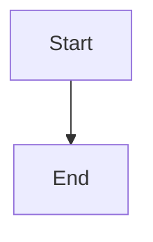

# Add a New Markdown Doc to Brain Blips

Follow every step below in order. Do not skip sidebar registration or build verification.

## Prerequisites

Confirm with the user (or infer from context):

- **Title** — display name for the page
- **Category** — which section the page belongs in
- **Purpose** — what the page should cover

## Step 1 — Choose the target directory

Place the file under `docs/` in the matching category:

| Category | Directory | Sidebar label |
|----------|-----------|---------------|
| AI & ML | `docs/ai/` | AI & Machine Learning |
| Docker | `docs/docker/` | Docker |
| Kubernetes | `docs/Kubernetes/` | Kubernetes (note capital **K**) |
| Optical Network Copilot | `docs/optical-network-copilot/` | Optical Network AI Copilot |
| Claude integration | `docs/optical-network-copilot/claude/` | Claude Integration (nested) |
| MCP servers | `docs/optical-network-copilot/mcp-servers/` | MCP Servers (nested) |
| Prompt filtering | `docs/optical-network-copilot/prompt-filtering/` | Prompt Filtering (nested) |
| Meta / tooling | `docs/meta/` | Meta Documentation |

For a new subtopic with multiple pages, create a subfolder (e.g. `docs/ai/new-topic/`).

## Step 2 — Choose the filename

- Use **kebab-case**: `my-new-guide.md`
- For a section landing page in a folder, use `index.md` (sidebar ID omits `/index`, e.g. `mcp-servers/lab-manager/index`)
- Do **not** rename existing files — links and sidebar entries depend on current paths

## Step 3 — Create the markdown file

Create the file with YAML frontmatter. Minimum required fields:

```yaml
---
title: Page Title
sidebar_position: 1
---
```

Add optional fields when useful (match neighboring docs in the same folder):

```yaml
---
title: Page Title
sidebar_position: 3
sidebar_label: Short Label
description: One-line summary for SEO and previews
tags: [tag-one, tag-two]
keywords: [search, terms]
---
```

**`sidebar_position`:** pick a number that orders the page among siblings. Read neighboring files in the same folder to avoid collisions.

## Step 4 — Write the page content

1. Start with an `#` heading matching the title (or let frontmatter `title` be the H1 — follow the folder's existing pattern).
2. Match tone and structure of neighboring docs.
3. Use `##` / `###` for sections (table of contents covers levels 2–4).
4. Use Docusaurus admonitions where appropriate: `:::info`, `:::tip`, `:::warning`, `:::danger`.
5. Use Mermaid for diagrams:

````markdown

````

6. For Optical Network Copilot content, align terminology with `docs/optical-network-copilot/glossary.md`.
7. For technical guides, verify commands are correct and copy-pasteable.
8. Avoid raw JSX in `.md` files (`format: 'detect'` is enabled).

## Step 5 — Register in `sidebars.js`

Every new page **must** be added to `sidebars.js` or it will not appear in navigation.

1. Open `sidebars.js`.
2. Find the correct category block (see table in Step 1).
3. Add the doc ID — path under `docs/` **without** `.md`:

```js
// Single file
'docker/my-new-guide'

// File in subfolder with index.md
'optical-network-copilot/mcp-servers/my-server/index'

// New nested category
{
  type: 'category',
  label: 'My Subcategory',
  items: [
    'optical-network-copilot/my-subcategory/page-one',
    'optical-network-copilot/my-subcategory/page-two',
  ],
},
```

4. Place the entry in logical order among sibling items.
5. Set `collapsed` on new categories to match siblings (`false` for main sections, `true` for Meta).

## Step 6 — Add cross-links (if applicable)

- Link to related docs using relative paths or Docusaurus doc paths.
- Update related pages that should point to the new doc.
- `onBrokenLinks: 'throw'` in `docusaurus.config.js` — invalid links fail the build.

## Step 7 — Verify the build

Run from the project root:

```bash
pnpm build
```

Fix any errors before finishing:

| Error | Fix |
|-------|-----|
| Broken link | Correct the URL or remove the link |
| Duplicate route | Check for conflicting filenames/paths |
| MDX parse error | Remove JSX from `.md` or rename to `.mdx` |

Optional local preview:

```bash
pnpm start
```

## Step 8 — Report to the user

Summarize what was done:

- File path created
- Sidebar category and position
- Build result (`pnpm build` pass/fail)
- Any follow-up the user may want (cross-links, images in `static/img/`, README update)

## Checklist

Copy and track progress:

```
- [ ] Step 1: Directory chosen
- [ ] Step 2: Filename chosen (kebab-case)
- [ ] Step 3: File created with frontmatter
- [ ] Step 4: Content written
- [ ] Step 5: sidebars.js updated
- [ ] Step 6: Cross-links added (if needed)
- [ ] Step 7: pnpm build passes
- [ ] Step 8: User informed
```

## Examples

### Example A — Docker guide

**Request:** "Add a page about Docker networking"

1. File: `docs/docker/networking.md`
2. Frontmatter: `title: Docker Networking`, `sidebar_position: 4`
3. Sidebar: add `'docker/networking'` to the Docker `items` array after `install-docker-compose`
4. Run `pnpm build`

### Example B — MCP server doc

**Request:** "Document a new MCP server called inventory-manager"

1. File: `docs/optical-network-copilot/mcp-servers/inventory-manager/index.md`
2. Frontmatter: include `sidebar_label: Inventory Manager`, tags `[mcp-server, inventory]`
3. Sidebar: add `'optical-network-copilot/mcp-servers/inventory-manager/index'` under MCP Servers `items`
4. Run `pnpm build`

### Example C — Meta doc

**Request:** "Add AGENTS.md explanation to meta docs"

1. File: `docs/meta/agents-md.md`
2. Sidebar: add `'meta/agents-md'` to Meta Documentation `items`
3. Run `pnpm build`

## Do not

- Edit `build/`, `.docusaurus/`, or `node_modules/`
- Commit unless the user explicitly asks
- Create README or summary files the user did not request
- Use `npm` or `yarn` — this project uses **pnpm**
