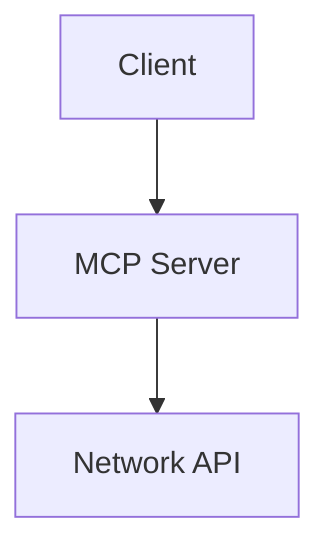

# Brain Blips — Agent Instructions

## Project overview

Brain Blips is a **Docusaurus 3.9.2** static documentation site — a personal knowledge base for AI, DevOps, and network engineering. Most work is **markdown documentation** in `docs/`, not application code.

| Item | Value |
|------|-------|
| Stack | Docusaurus 3.9.2, React 18, MDX 3, TypeScript ~5.7 |
| Runtime | Node.js >= 20 |
| Package manager | **pnpm** (not npm or yarn) |
| Primary content | `docs/` |
| Site config | `docusaurus.config.js`, `sidebars.js` |
| Custom UI | `src/pages/`, `src/components/`, `src/css/custom.css` |

**Primary documentation focus:** Optical Network AI Copilot (`docs/optical-network-copilot/`). Supporting topics: AI/ML, Docker, Kubernetes, and meta docs (`docs/meta/`).

**Do not edit generated output:** `build/`, `.docusaurus/`, `node_modules/`.

## Dev environment

```bash
source ~/.nvm/nvm.sh && nvm use 20   # if using nvm
pnpm install
pnpm start                           # http://localhost:3000
```

## Build and verification

Run these before finishing doc or site changes:

```bash
pnpm build        # required — onBrokenLinks is 'throw'; broken links fail the build
pnpm typecheck    # when editing TS/JS config or src/
pnpm serve        # optional — preview production build locally
```

Docker (optional):

```bash
docker build -t brainblips .
```

## Adding or editing documentation

### 1. Place files in the right category

```
docs/
├── ai/                          # AI & ML guides
├── docker/                      # Docker installation and usage
├── Kubernetes/                  # K8s / K3s guides (note capital K)
├── optical-network-copilot/     # Main project documentation
└── meta/                        # Project meta (setup, structure, skills)
```

### 2. Add Docusaurus frontmatter

Every doc page needs YAML frontmatter at the top:

```yaml
---
title: Page Title
sidebar_position: 1
---
```

Optional fields used in this project: `description`, `tags`, `keywords`.

### 3. Update navigation

New pages must be registered in `sidebars.js` unless they live under an autogenerated sidebar path. Match the existing category structure and item ID format (path without `.md`, e.g. `docker/introduction`).

### 4. Writing conventions

- Match the tone and structure of neighboring docs in the same folder.
- Use `##` / `###` headers; table of contents covers levels 2–4.
- Prefer **Mermaid** for architecture and flow diagrams (enabled in `docusaurus.config.js`).
- Use Docusaurus admonitions where appropriate: `:::info`, `:::tip`, `:::warning`, `:::danger`.
- Internal doc links: use relative paths or Docusaurus doc IDs; verify they resolve (`pnpm build` enforces this).
- Keep filenames in **kebab-case**. Do not rename existing files (e.g. `simple_k3s_cluester.md`) unless explicitly asked — links and sidebar entries depend on them.

### Mermaid example

````markdown

````

## Code and config changes

Scope changes narrowly. This repo is mostly docs; avoid unrelated refactors.

| File | Purpose |
|------|---------|
| `docusaurus.config.js` | Site title, URL, theme, plugins, navbar/footer |
| `sidebars.js` | Sidebar navigation |
| `src/pages/index.js` | Homepage |
| `src/css/custom.css` | Global styles and theme colors |
| `static/img/` | Images, logo, favicon |

When editing React/JS in `src/`, follow existing patterns (functional components, CSS modules in `src/`).

## Content guidelines

- **Accuracy over volume** — technical guides (Docker, K3s, MCP) should be actionable and command-verified.
- **Optical Network Copilot docs** — preserve architectural terminology; check `docs/optical-network-copilot/glossary.md` for defined terms.
- **Meta docs** — `docs/meta/cursor-setup.md`, `docs/meta/project-structure.md`, and `docs/meta/ai-skills-system.md` describe tooling conventions; align with them when touching related topics.
- Do not create new markdown files the user did not ask for (e.g. extra READMEs or summaries).
- Do not add tests unless requested — this project has no test suite today.

## Git and PR workflow

- **Only commit when the user explicitly asks.**
- Do not push to remote unless asked.
- Suggested commit style: short imperative subject (`Add K3s troubleshooting section`, `Fix broken MCP server link`).
- Before suggesting a PR: run `pnpm build`, confirm the change is limited to the requested scope.

## Security

- Never commit secrets (`.env*`, API keys, tokens).
- Do not embed real hostnames, credentials, or internal URLs from the user's environment unless they appear in existing docs.
- `.dockerignore` excludes `AGENTS.md` and `README.md` from images — that is intentional.

## Common pitfalls

1. **Forgetting `sidebars.js`** — new pages won't appear in navigation.
2. **Broken links** — `onBrokenLinks: 'throw'` fails the build; fix or remove bad links.
3. **Editing `build/`** — always edit source in `docs/` or `src/`, then rebuild.
4. **Wrong package manager** — use `pnpm`, not `npm install`.
5. **MDX vs MD** — `format: 'detect'` is set; avoid raw JSX in `.md` files unless the file is intended as MDX.

## Reference docs in this repo

- Human-oriented setup: `README.md`
- Cursor / MCP setup: `docs/meta/cursor-setup.md`
- Doc structure: `docs/meta/project-structure.md`
- AI skills pattern: `docs/meta/ai-skills-system.md`
