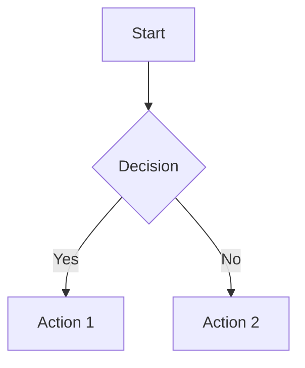

# Brain Blips 🧠⚡

> A personal knowledge base for AI, DevOps, and Network Engineering

This website is built using [Docusaurus 3.9.2](https://docusaurus.io/), a modern static website generator, and serves as a centralized documentation hub for technical knowledge, research, and project documentation.

## 🎯 Project Overview

**Brain Blips** is a comprehensive knowledge management system focused primarily on **Optical Network AI Copilot** development, with supporting documentation for AI/ML technologies, Docker, and development workflows.

### Primary Focus: Optical Network AI Copilot 🚀

The main content of this site documents the **Optical Network AI Copilot** project - an AI-powered system for network operations and development assistance. This includes:

- **System Architecture** - Core architecture and design patterns (7 documents)
- **Claude Integration** - LLM integration and server requirements (3 documents)
- **MCP Servers** - Model Context Protocol server implementations (4 documents)
- **Prompt Filtering** - Research and optimization strategies (1 document)
- **Markdown Enhancement Plan** - Advanced documentation features
- **Implementation Roadmap** - Project planning and success factors

**Total Optical Network Copilot Documentation:** 18+ files

## 📚 Content Categories

### 🤖 AI & Machine Learning
- **LM Studio** - Local model management and MCP integration
  - DeepSeek R1 Distill Qwen 7B with MCP
- **Total Files:** 1

### 🐳 Docker
- Docker installation guides for Ubuntu 24.04
- Docker Compose setup instructions
- Container management basics
- **Total Files:** 3

### ☸️ Kubernetes
- K3s cluster setup (3-node, load balancer, Portainer CE)
- **Total Files:** 1

### 🔬 Optical Network AI Copilot
The primary focus of this documentation site, covering:
- **Core Documentation:** Project overview, architecture, implementation roadmap
- **Claude Integration:** LLM server requirements, client setup, technical analysis
- **MCP Servers:** Lab Manager, Optical Specialist, T-API Gateway, conversation examples
- **Prompt Filtering:** Research and optimization techniques
- **System Design:** Architecture diagrams and enhancement plans
- **Total Files:** 18+

### 📖 Meta Documentation
- Project structure and organization
- Cursor IDE setup and configuration
- MCP server documentation
- BrainBlips original README
- **Total Files:** 4

---

## ✨ Features

- 🎨 **Mermaid Diagram Support** - Interactive diagrams and flowcharts
- 📊 **System Architecture Visualizations** - Technical diagrams for complex systems
- 🔍 **Advanced Markdown** - Enhanced markdown capabilities for technical documentation
- 🌓 **Dark Mode** - Theme switching support
- 🔗 **Cross-Referenced Documentation** - Interconnected knowledge base
- 📱 **Responsive Design** - Mobile-friendly documentation


## 🚀 Quick Start

### Prerequisites

- **Node.js** >= 20.0 (managed via nvm)
- **nvm** (Node Version Manager) - for managing Node.js versions
- **pnpm** (recommended package manager)

### 🎯 First Time Setup

#### Step 1: Ensure Node.js v20 is Active

Make sure Node.js v20 is active using nvm:

```bash
source ~/.nvm/nvm.sh
nvm use 20
```

*If Node.js v20 is not installed, run:*
```bash
nvm install 20
nvm use 20
```

#### Step 2: Install Dependencies

Install all required dependencies (~300+ packages, may take 2-3 minutes):

```bash
pnpm install
```

#### Step 3: Start Development Server

Once dependencies are installed, start the local development server:

```bash
pnpm start
```

This command starts a development server at `http://localhost:3000` and opens a browser window. Most changes are reflected live without restarting the server.

### 🔨 Common Commands

#### Build for Production

Generate static content for deployment:

```bash
pnpm build
```

Static files are generated in the `build/` directory and can be served using any static hosting service.

#### Preview Production Build

Test the production build locally:

```bash
pnpm serve
```

#### Deployment

**Using SSH:**
```bash
USE_SSH=true pnpm deploy
```

**Not using SSH:**
```bash
GIT_USER=<Your GitHub username> pnpm deploy
```

*Note: If using GitHub Pages, this builds the site and pushes to the `gh-pages` branch.*

### 🎯 Key Files to Edit

Once your development environment is set up, here are the key files you'll want to customize:

- **`docusaurus.config.js`** - Site configuration (title, URLs, theme settings)
- **`sidebars.js`** - Navigation sidebar structure
- **`docs/intro.md`** - First documentation page (or create your own)
- **`src/pages/index.js`** - Homepage customization
- **`src/css/custom.css`** - Global styles and theme colors
- **`blog/`** - Add your blog posts here (if using blog feature)
- **`static/`** - Add images, favicons, and other static files

### 📚 Helpful Resources

- [Docusaurus Documentation](https://docusaurus.io/docs)
- [Docusaurus Tutorial](https://docusaurus.io/docs/category/tutorial---basics)
- [Markdown Features](https://docusaurus.io/docs/markdown-features)
- [Mermaid Diagram Syntax](https://mermaid.js.org/)

---

## 📖 Documentation Structure

```
docs/
├── ai/                              # AI & Machine Learning (1 file)
│   └── lm-studio/
│       └── enhancing-deepseek.md
├── docker/                          # Docker Documentation (3 files)
│   ├── introduction.md
│   ├── install-docker.md
│   └── install-docker-compose.md
├── Kubernetes/                      # Kubernetes Documentation (1 file)
│   └── simple_k3s_cluester.md
├── optical-network-copilot/         # Main Content (18+ files)
│   ├── project-overview.md
│   ├── system-architecture-diagram.md
│   ├── core-architecture.md
│   ├── network-operations-copilot.md
│   ├── development-copilot.md
│   ├── implementation-roadmap.md
│   ├── success-factors.md
│   ├── markdown-enhancement-plan.md
│   ├── claude/                     # Claude Integration (3 files)
│   │   ├── claude-client.md
│   │   ├── llm-server-requirements.md
│   │   └── why-problematic.md
│   ├── mcp-servers/                # MCP Servers (4 files)
│   │   ├── lab-manager/index.md
│   │   ├── optical-specialist/index.md
│   │   ├── t-api-gateway/index.md
│   │   └── conversation-example.md
│   └── prompt-filtering/           # Prompt Filtering (1 file)
│       └── research.md
└── meta/                            # Meta Documentation (4 files)
    ├── brainblips-readme.md
    ├── cursor-setup.md
    ├── mcp-servers.md
    └── project-structure.md
```

**Total Documents:** 27+ markdown files

---

## 🔧 Configuration

### Core Configuration Files

- **`docusaurus.config.js`** - Main Docusaurus configuration
  - Site title: "Brain Blips"
  - Tagline: "A personal knowledge base for AI, DevOps, and Network Engineering"
  - Mermaid diagram support enabled
  - Theme: Classic preset with custom styling

- **`sidebars.js`** - Navigation sidebar structure
  - Organized into 5 main categories
  - Hierarchical document organization
  - Collapsible sections for Meta Documentation

- **`package.json`** - Dependencies and scripts
  - Docusaurus: 3.9.2
  - React: 18.3.1
  - TypeScript: ~5.7.2
  - Node.js: >=20.0

### Theme & Styling

- **Mermaid Support:** `@docusaurus/theme-mermaid` - Interactive diagrams
- **Custom CSS:** `src/css/custom.css` - Custom color schemes and styling
- **Prism Theme:** GitHub light / Dracula dark themes for code blocks

---

## 📝 Adding New Content

### Creating a New Document

1. **Create the markdown file** in the appropriate `docs/` subdirectory:
   ```bash
   touch docs/[category]/[document-name].md
   ```

2. **Add frontmatter** to the top of the file:
   ```yaml
   ---
   title: Your Document Title
   sidebar_position: 1
   ---
   ```

3. **Update navigation** (if needed) in `sidebars.js`

4. **Preview changes**:
   ```bash
   pnpm start
   ```

### Using Mermaid Diagrams

You can create diagrams using Mermaid syntax:

````markdown

````

---

## 🎨 Customization

### Styling
- **Global Styles:** `src/css/custom.css` - Colors, fonts, and global CSS
- **Theme Colors:** Defined in `custom.css` with CSS variables
- **Dark Mode:** Built-in theme switching support

### Branding
- **Site Title:** Edit `title` in `docusaurus.config.js`
- **Tagline:** Edit `tagline` in `docusaurus.config.js`
- **Logo:** Replace `static/img/logo.svg`
- **Favicon:** Replace `static/img/favicon.ico`

### Content
- **Homepage:** `src/pages/index.js` - Landing page customization
- **Footer:** Configure in `docusaurus.config.js` under `themeConfig.footer`
- **Navbar:** Configure in `docusaurus.config.js` under `themeConfig.navbar`

---

## 💻 Technology Stack

### Core Technologies
- **[Docusaurus](https://docusaurus.io/)** 3.9.2 - Static site generator
- **[React](https://react.dev/)** 18.3.1 - UI framework
- **[TypeScript](https://www.typescriptlang.org/)** ~5.7.2 - Type safety
- **[MDX](https://mdxjs.com/)** 3.1.0 - Markdown with JSX

### Special Features
- **[@docusaurus/theme-mermaid](https://docusaurus.io/docs/markdown-features/diagrams)** - Diagram rendering
- **[Prism React Renderer](https://github.com/FormidableLabs/prism-react-renderer)** - Syntax highlighting
- **Node.js** >=20.0 - Runtime environment
- **pnpm** - Fast, disk space efficient package manager

---

## 🎯 Project Goals

Brain Blips serves as:

1. **Knowledge Repository** - Centralized location for technical documentation and research
2. **Project Documentation Hub** - Comprehensive documentation for the Optical Network AI Copilot
3. **Learning Resource** - Guides and tutorials for AI/ML, Docker, and network engineering
4. **Reference Material** - Quick access to setup guides, architectural decisions, and best practices
5. **Collaboration Platform** - Shareable documentation for team collaboration

---

## 📂 Project Structure

```
docusaurus/
├── docs/                    # All documentation content
├── blog/                    # Blog posts (optional)
├── src/                     # Custom React components
│   ├── components/          # Reusable components
│   ├── css/                 # Custom CSS
│   └── pages/               # Custom pages
├── static/                  # Static assets
│   └── img/                 # Images and icons
├── sidebars.js             # Sidebar navigation config
├── docusaurus.config.js    # Main configuration
├── package.json            # Dependencies
└── README.md               # This file
```

---

## 🔍 Key Documentation Highlights

### Optical Network AI Copilot
- **[Project Overview](docs/optical-network-copilot/project-overview.md)** - Vision and scope
- **[System Architecture](docs/optical-network-copilot/system-architecture-diagram.md)** - Technical design
- **[Implementation Roadmap](docs/optical-network-copilot/implementation-roadmap.md)** - Development timeline
- **[MCP Servers](docs/optical-network-copilot/mcp-servers/)** - Server implementations

### Getting Started
- **[Docker Installation](docs/docker/install-docker.md)** - Ubuntu 24.04 setup
- **[Simple K3s Cluster](docs/Kubernetes/simple_k3s_cluester.md)** - Lightweight Kubernetes setup
- **[LM Studio with MCP](docs/ai/lm-studio/enhancing-deepseek.md)** - Local AI model setup
- **[Cursor IDE Setup](docs/meta/cursor-setup.md)** - Development environment

---

## 🤝 Contributing

This is a personal knowledge base, but contributions, suggestions, and discussions are welcome!

### How to Contribute

1. **Fork the repository** (when available)
2. **Create a feature branch** (`git checkout -b feature/amazing-addition`)
3. **Make your changes** and test locally with `pnpm start`
4. **Commit your changes** (`git commit -m 'Add some amazing content'`)
5. **Push to the branch** (`git push origin feature/amazing-addition`)
6. **Open a Pull Request**

### Content Guidelines

- Follow existing markdown formatting conventions
- Include proper frontmatter (title, sidebar_position)
- Add Mermaid diagrams for complex concepts
- Test locally before submitting
- Ensure links work correctly

---

## 📄 License

This project is open source and available under the [MIT License](LICENSE).

---

## 🔗 Useful Links

### Docusaurus Resources
- [Docusaurus Documentation](https://docusaurus.io/) - Official docs
- [Docusaurus GitHub](https://github.com/facebook/docusaurus) - Source code
- [Mermaid.js](https://mermaid.js.org/) - Diagram syntax

### Related Projects
- [Obsidian](https://obsidian.md/) - Original note-taking tool
- [Cursor IDE](https://cursor.sh/) - AI-powered IDE
- [Claude AI](https://www.anthropic.com/claude) - LLM integration

---

## 📊 Project Status


**Last Updated:** June 16, 2026  
**Migration Completed:** October 21, 2025  
**Status:** ✅ Active Development

---

**Built with ❤️ using Docusaurus | Powered by Brain Blips Knowledge Base**
