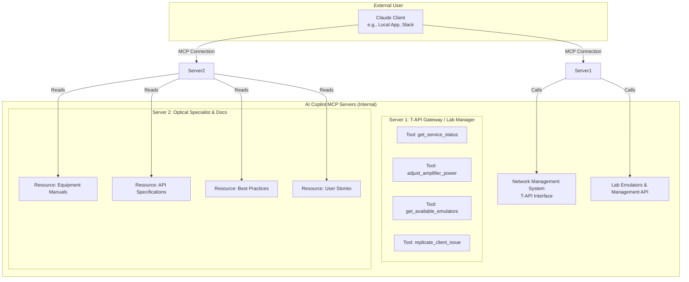

# Core Architecture: The MCP Framework

## Navigation
- [01 - Project Overview](Project%20Ideas/Optical%20Network%20AI%20Copilot/01%20-%20Project%20Overview)
- [03 - Network Operations Copilot](Project%20Ideas/Optical%20Network%20AI%20Copilot/03%20-%20Network%20Operations%20Copilot)
- [04 - Development Copilot](Project%20Ideas/Optical%20Network%20AI%20Copilot/04%20-%20Development%20Copilot)
- [05 - Implementation Roadmap](Project%20Ideas/Optical%20Network%20AI%20Copilot/05%20-%20Implementation%20Roadmap)
- [06 - Success Factors & Conclusion](Project%20Ideas/Optical%20Network%20AI%20Copilot/06%20-%20Success%20Factors%20%26%20Conclusion)

---

The solution is built on Anthropic's Model Context Protocol (MCP), which allows a Claude Client to connect to custom-defined resources and tools.

