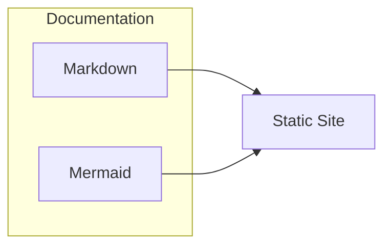

# Documentation Guide

This guide is for contributors who want to write or edit documentation.

## Overview

This documentation is built with [Docsify](https://docsify.js.org), Markdown, and Mermaid for diagrams. For project setup and configuration, see [Configuration](setup/) instead.

## Writing Documentation

- Edit Markdown files in the `docs/` directory
- Add new pages and update `_sidebar.md` for navigation
- Use ` ```mermaid` fenced code blocks for diagrams

## Local Preview

Run the docs server to preview changes:

```bash
docsify serve docs
```

Then open [http://localhost:3000](http://localhost:3000) in your browser.

## Example Diagram


