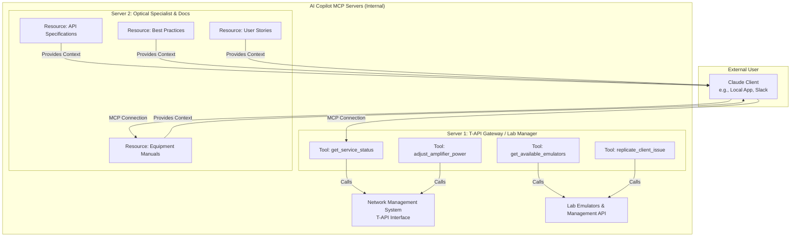

# Core Architecture: The MCP Framework

The solution is built on Anthropic's Model Context Protocol (MCP), which allows a Claude Client to connect to custom-defined resources and tools.

## System Architecture Overview

:::info Architecture Layers
The system consists of three main layers: External User (Claude Client), MCP Servers (tools and knowledge), and Backend Systems (network and lab infrastructure).
:::
