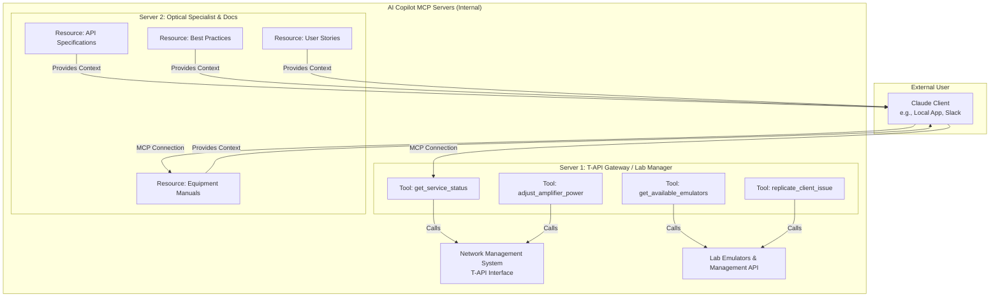

# AI Copilot System Architecture

This diagram illustrates the high-level architecture of the AI Copilot system, showing how Claude clients interact with MCP servers and backend systems.

## Architecture Overview

## Components Description

### External User Layer

:::tip User Interface
The Claude Client serves as the primary interaction point for all users.
:::

| Component | Description | Deployment Options |
|-----------|-------------|-------------------|
| **Claude Client** | AI interface for system interaction | Local desktop app, Slack integration |

### MCP Server Layer

#### Server 1: T-API Gateway / Lab Manager

:::note Operational Tools Server
Provides actionable tools for network management and lab operations.
:::

| Tool | Function |
|------|----------|
| `get_service_status` | Retrieves current status of network services |
| `adjust_amplifier_power` | Modifies optical amplifier settings |
| `get_available_emulators` | Lists available network emulators |
| `replicate_client_issue` | Replicates customer-reported issues in lab |

#### Server 2: Optical Specialist & Docs

:::note Knowledge Resources Server
Provides contextual knowledge and documentation access.
:::

| Resource | Content Type |
|----------|--------------|
| Equipment Manuals | Technical specifications and operation guides |
| API Specifications | Interface documentation for T-API |
| Best Practices | Industry standards and recommendations |
| User Stories | Real-world use cases and solutions |

### Backend Systems

| System | Purpose | Interface |
|--------|---------|-----------|
| **Network Management System (NMS)** | Production network management | T-API interface |
| **Lab Emulators & Management API** | Testing and simulation | Management API |

## Data Flow

The following sequence describes the interaction pattern:

1. **Users interact** with the Claude Client
2. **Claude connects** to both MCP servers via MCP protocol
3. **Server 1 executes** operational tools that interact with NMS and Lab systems
4. **Server 2 provides** contextual knowledge from documentation resources
5. **Claude combines** tool results and knowledge to provide intelligent responses

