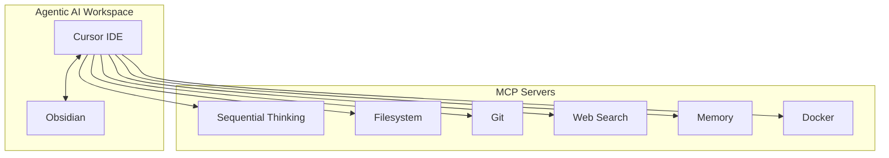

# Cursor IDE Setup for Note-Taking and Research

This document explains the complete Cursor IDE configuration for the Agentic AI project, optimized for note-taking, research, and knowledge management.

## Overview

The Agentic AI workspace is configured as a hybrid development and knowledge management environment using Cursor IDE with Obsidian integration and Model Context Protocol (MCP) servers for enhanced AI capabilities.



## Project Configuration

### Basic Settings

```json
{
  "projectName": "Agentic AI",
  "defaultLanguage": "markdown",
  "framework": "obsidian",
  "packageManager": "none",
  "rootDirectory": ".",
  "sourceDirectory": ".",
  "buildDirectory": ".",
  "testDirectory": "."
}
```

**Key Configuration Details:**
- **Project Name**: Agentic AI
- **Default Language**: Markdown (optimized for note-taking)
- **Framework**: Obsidian (for knowledge graph and note management)
- **Package Manager**: None (pure markdown-based project)

## File Organization

### Include Patterns
The workspace is configured to include:

```text
Docker/**/*          # Docker documentation and configurations
images/**/*          # Images and media files
.cursor/**/*         # Cursor IDE configuration
.obsidian/**/*       # Obsidian vault configuration
*.md                 # All markdown files
*.json               # JSON configuration files
*.yml, *.yaml        # YAML configuration files
*.png, *.jpg, *.jpeg # Image files
*.gif, *.svg         # Additional image formats
```

### Exclude Patterns
The following are excluded from indexing:

```text
node_modules/**/*    # Node.js dependencies
target/**/*          # Build targets
dist/**/*           # Distribution files
.next/**/*          # Next.js build files
build/**/*          # Build artifacts
*.log               # Log files
*.tmp               # Temporary files
.git/**/*           # Git repository data
```

## Directory Structure

See [Project Structure](setup/project-structure) for the full directory layout and organization principles.

## MCP Servers

The workspace uses several Model Context Protocol (MCP) servers for AI-enhanced capabilities:

- **Sequential Thinking** — Structured problem-solving and research analysis
- **Filesystem** — File operations and content management
- **Git** — Version control and collaboration
- **Web Search** — Research and fact-checking
- **Memory** — Persistent context across sessions
- **Docker** — Container management and development environments

For configuration details, use cases, and troubleshooting, see [MCP Servers Configuration](setup/mcp-servers).

## Obsidian Integration (Optional)

Obsidian integration is optional. The workspace can be used with Cursor alone; Obsidian adds:

- **Knowledge Graph**: Visual representation of note connections
- **Note Linking**: Bidirectional linking between notes
- **Plugin Support**: Access to Obsidian's extensive plugin ecosystem
- **Vault Management**: Organized note storage and retrieval

### Obsidian Configuration Files
- `workspace.json`: Workspace layout and open files
- `graph.json`: Knowledge graph configuration
- `app.json`: Application settings

## Workflow for Note-Taking and Research

### 1. Creating New Notes
- Use Cursor's markdown support for creating structured notes
- Leverage Obsidian's linking syntax for connecting ideas
- Utilize the filesystem MCP server for automated file operations

### 2. Research Process
- Use the web search MCP server for gathering information
- Apply sequential thinking for complex analysis
- Store research findings in organized markdown files

### 3. Knowledge Management
- Create topic-based folders (AI, Docker, etc.)
- Use consistent naming conventions
- Leverage Obsidian's graph view for discovering connections

### 4. Version Control
- Git integration for tracking changes
- Commit research notes and documentation
- Collaborate using Git workflows

## Best Practices

### File Naming
- Use descriptive, kebab-case names for files
- Include dates for time-sensitive content
- Use consistent prefixes for different content types

### Content Organization
- Group related content in folders
- Use markdown headers for structure
- Include metadata in frontmatter when needed

### AI Integration
- Leverage MCP servers for enhanced capabilities
- Use sequential thinking for complex problems
- Maintain context with the memory server

## Troubleshooting

For detailed troubleshooting (MCP connection failures, permission errors, performance issues, debugging steps), see [MCP Servers — Troubleshooting](mcp-servers#troubleshooting).

**Quick reference:**
- **MCP Server Connection**: Ensure required packages are installed (`npx -y` will fetch them)
- **File Permissions**: Check write permissions for the workspace directory
- **Obsidian Sync**: Verify Obsidian vault is properly configured (Obsidian is optional)

---

*This setup provides a powerful environment for knowledge management, research, and development using modern AI-assisted tools.*
