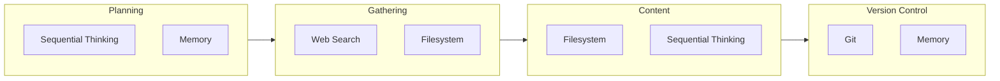

# Model Context Protocol (MCP) Servers Configuration

This document details the Model Context Protocol servers configured in the Agentic AI workspace and their specific use cases for note-taking and research.

## Overview

Model Context Protocol (MCP) servers extend Cursor IDE's capabilities by providing specialized AI-powered tools for various tasks. The Agentic AI workspace includes six MCP servers, each serving specific functions in the knowledge management and research workflow.

## Configured MCP Servers

### 1. Sequential Thinking Server

```json
"sequential-thinking": {
  "command": "npx",
  "args": ["-y", "@modelcontextprotocol/server-sequential-thinking"]
}
```

**Purpose**: Provides structured, step-by-step thinking capabilities for complex problem-solving and research analysis.

**Use Cases**:
- Breaking down complex research questions into manageable steps
- Analyzing multi-faceted problems systematically
- Planning research methodologies
- Structuring arguments and conclusions
- Debugging complex issues

**Benefits**:
- Enhanced reasoning capabilities
- Better problem decomposition
- Improved research planning
- More thorough analysis

### 2. Filesystem Server

```json
"filesystem": {
  "command": "npx",
  "args": ["-y", "@modelcontextprotocol/server-filesystem", "<WORKSPACE_ROOT>"]
}
```

**Path configuration**: Replace `<WORKSPACE_ROOT>` with your workspace path:
- **Linux/macOS**: `/path/to/agentic_ai` or `$HOME/code/agentic_ai`
- **Windows**: `C:\\Users\\YourName\\code\\agentic_ai` (use escaped backslashes)

**Purpose**: Enables AI to interact directly with the local filesystem for file operations and content management.

**Use Cases**:
- Automated file organization
- Content creation and editing
- File search and retrieval
- Directory structure management
- Batch file operations

**Benefits**:
- Streamlined file management
- Automated content organization
- Efficient research workflow
- Reduced manual file operations

### 3. Git Server

```json
"git": {
  "command": "npx", 
  "args": ["-y", "@modelcontextprotocol/server-git", "--repository", "<WORKSPACE_ROOT>"]
}
```

**Path configuration**: Replace `<WORKSPACE_ROOT>` with your workspace path (same as Filesystem server above).

**Purpose**: Provides Git integration for version control and collaboration features.

**Use Cases**:
- Tracking changes to research notes
- Collaborative editing workflows
- Version history management
- Branch management for different research topics
- Automated commit messages

**Benefits**:
- Complete version control
- Collaboration capabilities
- Change tracking
- Backup and recovery
- Research history preservation

### 4. Web Search Server

```json
"web-search": {
  "command": "npx",
  "args": ["-y", "@modelcontextprotocol/server-web-search"]
}
```

**Purpose**: Enables web search capabilities for research and fact-checking.

**Use Cases**:
- Real-time information gathering
- Fact verification
- Current event research
- Academic paper discovery
- Technical documentation lookup

**Benefits**:
- Up-to-date information access
- Comprehensive research capabilities
- Fact-checking support
- Source discovery
- Current event awareness

### 5. Memory Server

```json
"memory": {
  "command": "npx",
  "args": ["-y", "@modelcontextprotocol/server-memory"]
}
```

**Purpose**: Provides persistent memory capabilities for maintaining context across sessions.

**Use Cases**:
- Remembering research preferences
- Maintaining context between sessions
- Storing frequently used information
- Personalizing AI interactions
- Building knowledge over time

**Benefits**:
- Contextual continuity
- Personalized experience
- Knowledge accumulation
- Reduced repetition
- Improved efficiency

### 6. Docker Server

```json
"docker": {
  "command": "npx",
  "args": ["-y", "@modelcontextprotocol/server-docker"]
}
```

**Purpose**: Enables Docker container management and development environment setup.

**Use Cases**:
- Development environment management
- Containerized tool setup
- Isolated research environments
- Reproducible development setups
- Service orchestration

**Benefits**:
- Environment consistency
- Easy tool installation
- Isolated workspaces
- Reproducible setups
- Service management

## Integration Workflow

### Research Process with MCP Servers



1. **Initial Research Planning**
   - Use **Sequential Thinking** to break down research questions
   - Use **Memory** to recall previous research patterns

2. **Information Gathering**
   - Use **Web Search** for current information
   - Use **Filesystem** to organize findings

3. **Content Creation**
   - Use **Filesystem** to create and edit notes
   - Use **Sequential Thinking** to structure content

4. **Version Control**
   - Use **Git** to track changes
   - Use **Memory** to remember commit patterns

5. **Environment Management**
   - Use **Docker** for specialized tools
   - Use **Filesystem** for configuration management

### Note-Taking Workflow

1. **Content Creation**
   - AI assists with note structure using Sequential Thinking
   - Filesystem server handles file creation and organization

2. **Research Integration**
   - Web Search provides current information
   - Memory server maintains research context

3. **Organization**
   - Filesystem server organizes content
   - Git server tracks changes

4. **Environment Setup**
   - Docker server provides specialized tools
   - Filesystem server manages configurations

## Best Practices

### Server Utilization

1. **Sequential Thinking**
   - Use for complex problem decomposition
   - Apply to research methodology planning
   - Leverage for argument structuring

2. **Filesystem**
   - Maintain consistent file organization
   - Use for automated content management
   - Apply to batch operations

3. **Git**
   - Commit frequently with descriptive messages
   - Use branches for different research topics
   - Maintain clean commit history

4. **Web Search**
   - Verify information from multiple sources
   - Use for current event research
   - Apply to fact-checking

5. **Memory**
   - Store frequently used information
   - Maintain research preferences
   - Build knowledge over time

6. **Docker**
   - Use for isolated environments
   - Maintain reproducible setups
   - Apply to service management

### Performance Optimization

1. **Server Management**
   - Monitor server performance
   - Restart servers if needed
   - Update server packages regularly

2. **Resource Usage**
   - Be mindful of API rate limits
   - Optimize file operations
   - Manage memory usage

3. **Error Handling**
   - Monitor server logs
   - Handle connection failures gracefully
   - Implement fallback strategies

## Troubleshooting

### Common Issues

1. **Server Connection Failures**
   - Check network connectivity
   - Verify server packages are installed (`npx -y` fetches packages on demand)
   - Restart Cursor IDE if needed

2. **Permission Errors**
   - Verify file system permissions for `<WORKSPACE_ROOT>`
   - Check Git repository access
   - Ensure proper directory access (Filesystem and Git servers require the correct path)

3. **Performance Issues**
   - Monitor resource usage
   - Check for server conflicts
   - Optimize server configurations
   - Exclude unnecessary files from Cursor indexing (see [Cursor Setup](setup/cursor-setup))

4. **Obsidian Sync**
   - Verify Obsidian vault is properly configured
   - Obsidian integration is optional; the workspace works without it

### Debugging Steps

1. **Check Server Status**
   - Verify server processes are running
   - Check server logs for errors
   - Test individual server functionality

2. **Validate Configuration**
   - Review MCP server configurations in `.cursor/settings.json`
   - Check file paths and permissions (replace `<WORKSPACE_ROOT>` with your actual path)
   - Verify package installations

## Future Enhancements

### Potential Additions

1. **Database Server**
   - For structured data management
   - Research database integration
   - Query capabilities

2. **API Server**
   - For external service integration
   - Research API access
   - Data synchronization

3. **Visualization Server**
   - For data visualization
   - Research result presentation
   - Interactive charts

4. **Translation Server**
   - For multilingual research
   - Document translation
   - Cross-language analysis

### Configuration Improvements

1. **Server Orchestration**
   - Automated server management
   - Health monitoring
   - Performance optimization

2. **Custom Servers**
   - Domain-specific servers
   - Specialized research tools
   - Custom integrations

3. **Advanced Features**
   - Server chaining
   - Complex workflows
   - Advanced automation

---

*The MCP server configuration provides a powerful foundation for AI-enhanced research and knowledge management, with each server contributing specific capabilities to create a comprehensive research environment.*
