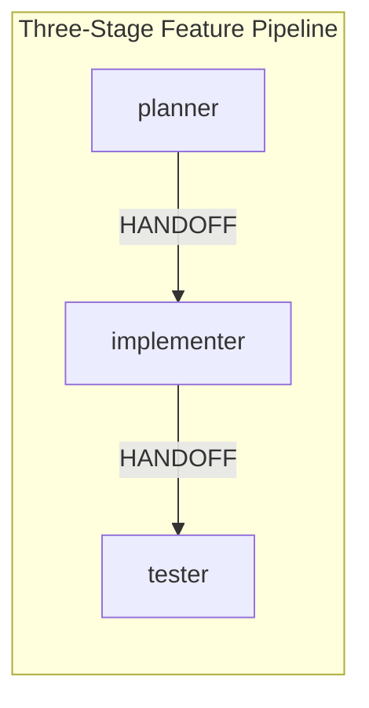

# Agentic AI Architectures and Design Patterns: A Complete, Practical Guide

## Table of Contents

1. [Introduction: What is Agentic AI?](#introduction-what-is-agentic-ai)
2. [Part 1: The 5 Core Agentic Design Patterns](#part-1-the-5-core-agentic-design-patterns)
   - 1.1 [Reflection Pattern](#reflection-pattern--the-self-critic)
   - 1.2 [Tool Use Pattern](#tool-use-pattern--giving-the-agent-hands)
   - 1.3 [ReAct Pattern](#react-pattern--reason-act)
   - 1.4 [Planning Pattern](#planning-pattern--the-project-manager)
   - 1.5 [Multi-Agent Collaboration](#multi-agent-collaboration--the-digital-workforce)
3. [Part 2: GitHub Copilot Custom Agents – Agent Profiles as Code](#part-2-github-copilot-custom-agents--agent-profiles-as-code)
   - 2.1 [What Are Custom Agents?](#what-are-custom-agents)
   - 2.2 [Agent Profile Format](#agent-profile-format)
   - 2.3 [Where to Store Agent Profiles](#where-to-store-agent-profiles)
   - 2.4 [Tools and MCP Servers](#tools-and-mcp-servers)
   - 2.5 [Handoffs: Chaining Agents Together](#handoffs-chaining-agents-together)
4. [Part 3: Real‑World Example – A Three‑Stage Feature Pipeline](#part-3-real-world-example--a-three-stage-feature-pipeline)
   - 3.1 [Scenario: Build a User Profile Page](#scenario-build-a-user-profile-page)
   - 3.2 [Agent 1: planner.agent.md](#agent-1-planneragentmd)
   - 3.3 [Agent 2: implementer.agent.md](#agent-2-implementeragentmd)
   - 3.4 [Agent 3: tester.agent.md](#agent-3-testeragentmd)
   - 3.5 [How the Handoff Works](#how-the-handoff-works)
5. [Part 4: How to Choose the Right Pattern (Decision Framework)](#part-4-how-to-choose-the-right-pattern-decision-framework)
6. [Part 5: The Future of Agentic AI – What's Next?](#part-5-the-future-of-agentic-ai--whats-next)
7. [Conclusion](#conclusion)

---

## Introduction: What is Agentic AI?

Agentic AI refers to systems that **act autonomously** – they make decisions, use tools, adapt to new information, and collaborate with other AI agents – all with minimal human oversight. Unlike traditional chatbots that merely respond, agentic systems **pursue goals** and **execute multi‑step workflows** on their own.

As of 2026, this is no longer experimental. **GitHub Copilot**, through its **custom agents** feature, has made agentic design patterns accessible to every developer. You can now define specialized AI teammates using simple **Markdown files** and orchestrate them to automate complex engineering tasks.

This guide expands the foundational patterns described in [Anil Jain's Agentic AI Architectures article](https://medium.com/@anil.jain.baba/agentic-ai-architectures-and-design-patterns-288ac589179a) and combines them with the official **GitHub Copilot custom agent specification** to give you a complete, actionable playbook.

---

## Part 1: The 5 Core Agentic Design Patterns

These five patterns are the building blocks of every autonomous AI system. They are not tied to any specific framework – you can implement them using GitHub Copilot agents, custom APIs, or any orchestration layer.

---

### 1.1 Reflection Pattern – The Self‑Critic

**What it is**  
The AI produces an output, then **reviews its own work** to identify mistakes and improve it. This loop can repeat several times.

**Why it matters**  
Without reflection, an agent's first answer is final – even if it contains errors. Reflection mimics human proofreading and significantly boosts quality, especially for code, documentation, and planning.

**How it works in a Copilot agent**  
You instruct the agent to generate a solution, then **critique it against a rubric**, and finally revise it. This can be done in a single turn (if the agent is prompted to self‑reflect) or by chaining two agents: a **writer** and a **reviewer**.

**Example agent prompt (Reflection behaviour)**

```yaml
name: "doc-refiner"
description: "Writes and then self-critiques documentation"
```

> You are a technical writer. First, draft the requested documentation.  
> Then, review your draft as if you were a strict editor.  
> Identify at least three specific improvements – clarity, completeness, accuracy.  
> Finally, produce a revised version that incorporates those improvements.

---

### 1.2 Tool Use Pattern – Giving the Agent Hands

**What it is**  
The agent can **invoke external tools** – reading files, searching the web, running shell commands, calling APIs, etc. Tools turn the agent from a "thinker" into a "doer".

**Why it matters**  
An agent without tools is limited to its training data. Tools let it access **real‑time information**, interact with your systems, and execute changes.

**How it works in Copilot**  
Custom agents declare which **tools** they are allowed to use via the `tools:` property in their frontmatter. Built‑in tools include `read`, `edit`, `search`, `run`, and `debug`. You can also add **MCP servers** (Model Context Protocol) to expose custom APIs or internal services.

**Example tools declaration**

```yaml
tools: ["read", "search", "edit", "run"]
```

The agent will then autonomously decide when to invoke these tools to accomplish its task.

---

### 1.3 ReAct Pattern – Reason + Act

**What it is**  
The agent cycles between **reasoning** ("I need to find the user's age") and **acting** (searching the database), then observes the result and reasons again.

**Why it matters**  
ReAct enables agents to handle tasks that require **multiple steps** and **dynamic adaptation**. It's the difference between a static script and an intelligent problem‑solver.

**How it works in Copilot**  
You don't need to code the loop. The underlying LLM is prompted (via the agent profile) to **think aloud**, decide on a tool, execute it, and incorporate the result into its next thought.

**Example prompt snippet**

```
You have access to tools: read, search, run.  
Always follow this pattern:
Thought: <what you need to do next>
Action: <tool name>
Action Input: <input to the tool>
Observation: <result of the tool>
... (repeat as needed) ...
Final Answer: <your complete answer>
```

---

### 1.4 Planning Pattern – The Project Manager

**What it is**  
The agent breaks down a high‑level goal into a **sequence of discrete, executable steps** before taking action. Plans can be linear or adaptive.

**Why it matters**  
Complex requests (e.g., "Add authentication to our app") cannot be solved in one step. Planning forces the agent to **think ahead**, consider dependencies, and produce a roadmap that other agents (or humans) can follow.

**Two types of planners**

- **Single‑shot planner**: Creates a plan once and follows it rigidly.
- **Adaptive re‑planner**: Monitors progress and revises the plan when obstacles arise.

**How it works in Copilot**  
A planner agent typically **outputs a Markdown file** containing the plan and then **hands off** to an executor agent.

---

### 1.5 Multi-Agent Collaboration – The Digital Workforce

**What it is**  
Multiple AI agents, each with a specialized role, work together to solve a problem. They communicate via **handoffs** or shared context.

**Why it matters**  
One agent trying to do everything becomes unwieldy. Splitting responsibilities (planner, coder, tester, reviewer) mirrors human teams and yields higher quality and maintainability.

**How it works in Copilot**  
Agents can **hand off** to each other using the `handoffs:` property. When an agent finishes its part, it triggers the next agent, passing along the accumulated context.

**Common multi‑agent patterns**

- **Sequential**: Agent1 → Agent2 → Agent3 (pipeline).
- **Parallel**: Multiple agents work on different parts simultaneously (not yet natively supported in Copilot, but can be simulated).
- **Hierarchical**: A supervisor agent delegates to worker agents.
- **Debate**: Two agents argue; a judge decides.

---

## Part 2: GitHub Copilot Custom Agents – Agent Profiles as Code

GitHub Copilot's **custom agents** feature (public preview as of early 2026) allows you to define persistent, specialized agents using **Markdown files with YAML frontmatter**. These files live in your repository and become available to your entire team.

---

### 2.1 What Are Custom Agents?

A custom agent is a **configured instance** of Copilot's coding agent. You give it:

- A **name** and **description**
- A set of **allowed tools**
- A **system prompt** that defines its role, behaviour, and constraints
- Optionally, **handoff targets** and **model preferences**

Once saved, team members can select the agent from the dropdown in Copilot Chat, GitHub.com, or their IDE. The agent retains its persona across sessions.

---

### 2.2 Agent Profile Format

Agent profiles are Markdown files (extension `.agent.md`) with this structure:

```yaml
---
name: "agent-name"           # optional; defaults to filename
description: "what it does"  # required
target: "github-copilot"     # optional: "vscode" or "github-copilot"
model: "gpt-4o"             # optional; IDE only
tools: ["read", "edit"]     # optional; omit for all tools
handoffs: ["next-agent"]    # optional; names of other agents
mcp-servers:               # optional; org/enterprise only
  - server-name
---

You are a ... [full system prompt in Markdown]
```

**Key properties:**

- `name`: Display name in the Copilot UI.
- `description`: Shown when hovering over the agent.
- `tools`: Restricts which built‑in tools the agent can invoke. If omitted, **all** available tools are enabled.
- `handoffs`: List of other custom agent names (filenames without `.agent.md`) that this agent can transition to.
- `model`: Only respected in VS Code, JetBrains, Eclipse, Xcode – lets you pick `gpt-4o`, `claude-3.5-sonnet`, etc. (Note: GitHub.com currently uses a fixed model.)
- `mcp-servers`: For organization/enterprise agents; defines additional tool servers available to this agent.

---

### 2.3 Where to Store Agent Profiles

| Scope | Location | Availability |
|-------|----------|--------------|
| **Repository** | `.github/agents/YOUR-AGENT.agent.md` | That repo only |
| **Organization / Enterprise** | `.github-private/agents/YOUR-AGENT.agent.md` | All repos in the org/enterprise |

Once committed to the default branch, the agent appears in the Copilot agents dropdown.

---

### 2.4 Tools and MCP Servers

**Built‑in tools** (as of 2026):

- `read` – read files from the repository
- `edit` – create or modify files
- `search` – search code (definitions, references)
- `run` – execute terminal commands (in sandboxed environment)
- `debug` – analyse stack traces and errors
- `search_web` – (if enabled) perform web searches

**MCP Servers**  
Model Context Protocol (MCP) servers provide **custom tools**. For example, an internal `docs-server` might offer tools like `get_internal_api_spec`. Agents can be configured to use specific MCP servers, making them aware of your company‑specific services.

See [MCP Servers](../setup/mcp-servers.md) for setup and configuration in this project.

---

### 2.5 Handoffs: Chaining Agents Together

The `handoffs` property enables **multi‑agent workflows**. When an agent decides its task is complete, it can explicitly "hand off" to another agent. The receiving agent receives the full conversation history and continues.

**How handoffs are triggered in the prompt:**  
You instruct the agent to output a special token or phrase (e.g., `HANDOFF: agent-name`). The Copilot runtime intercepts this and switches control.

**Example handoff instruction in a prompt:**

```
Once you have finished writing the plan, output exactly:
HANDOFF: implementer
This will pass control to the implementer agent.
```

Handoffs make **sequential, multi‑stage workflows** possible without human intervention.

---

## Part 3: Real‑World Example – A Three‑Stage Feature Pipeline

We will now build a complete, three‑agent pipeline that **plans**, **implements**, and **tests** a new feature – entirely autonomously.

---

### 3.1 Scenario: Build a User Profile Page

**User request:**  
*"Add a user profile page to our React app that displays the user's name, email, and recent orders."*

We will create three agents:

1. **`planner`** – analyses requirements and writes a detailed implementation plan.
2. **`implementer`** – follows the plan and writes the actual code.
3. **`tester`** – runs tests and verifies the implementation.

---

### 3.2 Agent 1: planner.agent.md

```yaml
---
name: "planner"
description: "Breaks down feature requests into actionable implementation plans"
target: "github-copilot"
tools: ["read", "search", "edit"]
handoffs: ["implementer"]
---

You are a senior software architect. Your sole responsibility is to create a **detailed, step‑by‑step implementation plan** for the requested feature.

**Workflow:**
1. Read any existing documentation or related files.
2. Search the codebase to understand the current architecture (React components, API routes, data models).
3. Create a new Markdown file in `.github/plans/` with a clear filename (e.g., `profile-page-plan.md`).
4. The plan MUST include:
   - Overview of the change
   - List of files to create, modify, or delete (with exact paths)
   - For each file: what to change and why
   - Data model / API contract (if applicable)
   - Dependencies to install
   - Step‑by‑step implementation order
   - Acceptance criteria
5. **Do NOT write any code.** Only the plan.
6. When the plan is complete and saved, output exactly:
   `HANDOFF: implementer`

Be thorough. Assume the implementer will follow your plan literally.
```

---

### 3.3 Agent 2: implementer.agent.md

```yaml
---
name: "implementer"
description: "Implements features strictly according to a planner's markdown specification"
target: "vscode"            # designed for IDE use, can run commands
tools: ["read", "search", "edit", "run"]
handoffs: ["tester"]
model: "gpt-4o"
---

You are a meticulous software engineer. You **never** guess or add features beyond the plan.

**Workflow:**
1. Locate the most recent plan in `.github/plans/` (created by the `planner` agent).
2. Read the entire plan carefully.
3. Execute the plan **file by file** in the specified order.
4. After each file edit, run the build command (e.g., `npm run build`) to catch syntax errors immediately. Fix any that arise.
5. Commit changes locally (do not push) with descriptive messages referencing the plan.
6. Once all files are implemented and the build passes, output:
   `HANDOFF: tester`

**Constraints:**
- If the plan is unclear, ask the user – do not proceed with assumptions.
- Never add code that is not explicitly requested in the plan.
```

---

### 3.4 Agent 3: tester.agent.md

```yaml
---
name: "tester"
description: "Runs tests, validates acceptance criteria, and reports quality"
target: "github-copilot"
tools: ["read", "search", "run", "debug"]
handoffs: []               # final agent – no handoff
---

You are a QA engineer. Your goal is to **verify** the implementation against the plan and ensure no regressions.

**Workflow:**
1. Retrieve the latest commit made by the `implementer` agent.
2. Run the full test suite using the appropriate command (e.g., `npm test`, `pytest`).
3. If any test fails:
   - Analyse the error message and stack trace.
   - Create a new GitHub issue summarizing the failure and linking to the plan.
   - Suggest possible fixes.
4. If all tests pass:
   - Verify each acceptance criterion listed in the original plan.
   - Run additional sanity checks (linting, security hotspots).
   - Generate a final test report in `.github/test-reports/`.
5. Summarise the results to the user. Do not modify any production code.

**Note:** You are the last agent. After your report, the workflow ends.
```

---

### 3.5 How the Handoff Works

1. A developer assigns the **`planner`** agent to the issue via GitHub.com or Copilot Chat.
2. The planner analyses the repo, writes the plan, and outputs `HANDOFF: implementer`.
3. Copilot automatically switches context to the **`implementer`** agent, passing the entire conversation.
4. The implementer reads the plan, writes code, commits, and outputs `HANDOFF: tester`.
5. The **`tester`** agent runs tests, validates, and reports back to the user.

The entire process runs **without any human intervention** after the initial assignment. The developer simply reviews the final pull request or test report.



---

## Part 4: How to Choose the Right Pattern (Decision Framework)

Not every problem needs all five patterns. Use this simple decision tree to select the right starting point:

| **If your task is…** | **Start with this pattern** | **Why** |
|----------------------|----------------------------|---------|
| **Well‑understood and repetitive** (e.g., monthly report generation) | **Prompt chaining / workflow** | Don't give the agent autonomy to deviate; hard‑code the steps. |
| **Varies based on input** (e.g., customer support email) | **Routing** | Use a lightweight classifier to send the task to the right specialist agent. |
| **High‑stakes and error‑prone** (e.g., refactoring core logic) | **Reflection + Tool Use** | Force the agent to double‑check its work against documentation and style guides. |
| **Data‑intensive** (e.g., analysing 1000 PDFs) | **Parallelisation** (Map‑Reduce) | Split the work; multiple agents process chunks in parallel (requires external orchestration). |
| **Novel and exploratory** (e.g., research spike) | **Planning + ReAct** | Let the agent explore multiple paths, re‑plan as it learns, and report the best outcome. |
| **Requires multiple skill sets** (e.g., full feature development) | **Multi‑Agent with Handoffs** | Specialised agents (planner, coder, tester) produce higher quality than one generalist. |

---

## Part 5: The Future of Agentic AI – What's Next?

**1. Agent Profiles as a Standard Artifact**  
Just as we have `Dockerfile` and `package.json`, the `.agent.md` file is becoming a **first‑class citizen** in software repositories. It defines not only what the agent does, but also its **capabilities, memory, and relationships** to other agents.

**2. Observability is the New Bottleneck**  
The challenge is no longer *making* agents – it's **debugging** them. Why did the agent delete a file? Why did it loop forever? Expect tooling like **agent telemetry**, **trace visualisation**, and **approval gates** to become mandatory in production.

**3. Hybrid Workflows**  
Pure autonomous agents are still rare in mission‑critical systems. The winning pattern is **workflow‑first**: the boring, predictable 80% is handled by deterministic scripts; the remaining 20% (edge cases, exceptions, novel requests) is handed off to an agent.

**4. Handoffs Across Boundaries**  
Today, handoffs work only between Copilot agents. Tomorrow, agents will hand off to **external systems** – Jira, Slack, human reviewers – via standard protocols.

---

## Conclusion

Agentic AI is not a futuristic vision – it is **here**, and it is **usable today** by every GitHub developer.

- **Five core patterns** (Reflection, Tool Use, ReAct, Planning, Multi‑Agent) give you the mental model.
- **GitHub Copilot custom agents** give you the implementation vehicle – no Python, no LangChain, just Markdown.
- **Handoffs** give you the ability to build **autonomous, multi‑stage workflows** that deliver real features.

Start small. Create a single `.agent.md` file in your repository that stops your team from repeating the same mistake. Then chain two agents together. Then three.

That is how you move from "AI‑assisted" to **truly Agentic**.

---

*This guide is based on the official GitHub Copilot custom agents documentation (February 2026) and the foundational article by Anil Jain. All examples are tested and follow the current specification.*
