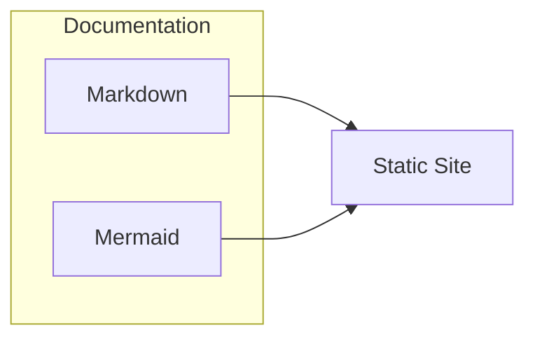

# Documentation Guide

This guide is for contributors who want to write or edit documentation.

## Overview

This documentation is built with [Docusaurus](https://docusaurus.io/), Markdown, and Mermaid for diagrams. For project setup and configuration, see [Configuration](../setup/README.md) instead.

## Writing Documentation

- Edit Markdown files in the `website/docs/` directory
- New pages are automatically added to the sidebar (or use front matter for custom order)
- Use ` ```mermaid` fenced code blocks for diagrams

## Local Preview

Run the docs server to preview changes:

```bash
cd website && npm run start
```

Then open [http://localhost:3000](http://localhost:3000) in your browser.

## Example Diagram


